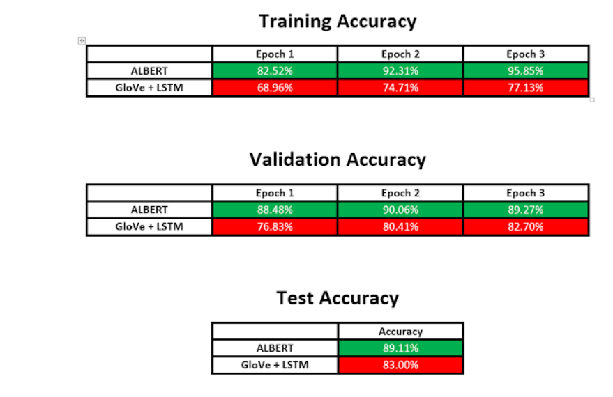

# Fine-tuning ALBERT for sarcasm detection

## Intro
Identifying sarcasm is often associated with human cognitive abilities and is one of the things that set humans apart from other species. However, recent advances in Natural Language Processing (NLP) has produced models that can perform well on Natural Language Understanding (NLU) tasks such as sarcasm detection. One of the NLP models is ALBERT which has established groundbreaking results on multiple benchmarks at the time of invention. In this repo, I will demonstrate the effectiveness of ALBERT on sarcasm detection. The results will be compared with a baseline NLP model to highlight the advances made in ALBERT.

Refer [here](https://arxiv.org/pdf/1909.11942.pdf) to learn more about ALBERT. 

---------------------------------------

## Data Exploration
The dataset used is "News Headlines dataset for Sarcasm Detection" which is collected from 2 news websites - The Onion and HuffPost. The dataset consist of 26k rows and 3 columns which are article link, headline and is sarcastic.

A few examples of the sarcastic headlines:

"robert de niro to turn 58 for movie role"

"heroic man rushes into movie theater, saves 4 seats"

"couple keeps marriage together for sake of no one"

"control freak wishes she had more free time"

The distribution for each of the two classes is shown below:

---------------------------------------------

## Baseline model - GloVe + LSTM
GloVe is a NLP embedding technique which represents every words (tokens) with a vector. The vectors contain meaningful information such as whether 2 words have similar meaning (semantic similarity between words). 

LSTM is a type of Recurrent Neural Network (RNN) which is suitable for processing sequence data such as text.

The full data analysis process can be found in [basline_model.ipynb](./baseline_model.ipynb)

Step 1 - Tokenization + Padding

Step 2 - Load pre-trained GloVe to embedding matrix

Step 3 - Build model architecture (Embedding + Dropout + LSTM)

Step 4 - Train model with train data

Step 5 - Evaluate model with test data

--------------------------------------------

## ALBERT

The full data analysis process can be found in [albert.ipynb](./albert.ipynb)

Step 1 - Tokenize + Preprocess train data

Step 2 - Load pre-trained ALBERT

Step 3 - Train ALBERT with train data

Step 4 - Evaluate ALBERT on test data

-----------------------------------------------

## Result

----------------------------------------------

## Conclusion

ALBERT has higher accuracy on all train, validation and test dataset compared to the baseline model. Further experiments can be done to evaluate ALBERT on different NLP task like question answering or Natural Language Inference (NLI) tasks. We can also compare ALBERT with other variants of BERT such as RoBERTa to evaluate their accuracy and training time.

-------------------------------------

## Reference

1. Lan, Z., Chen, M., Goodman, S., Gimpel, K., Sharma, P., & Soricut, R. (2020). ALBERT: A Lite BERT for Self-supervised Learning of Language Representations. ArXiv:1909.11942 [Cs]. https://arxiv.org/abs/1909.11942

2. Pennington, J. (2014). GloVe: Global Vectors for Word Representation. Stanford.edu. https://nlp.stanford.edu/projects/glove/

